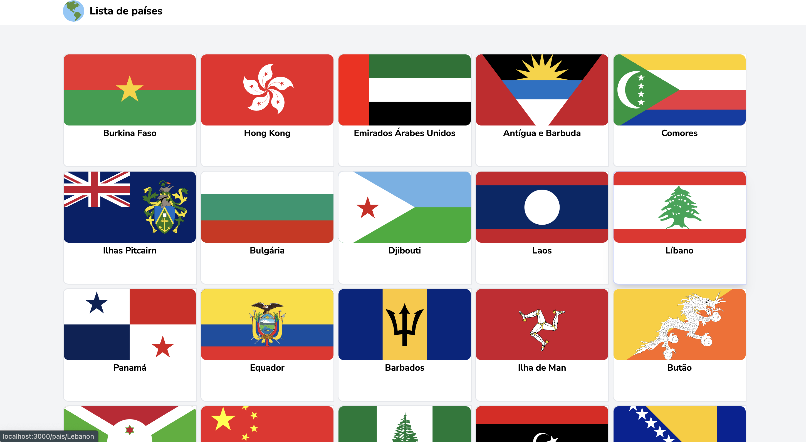
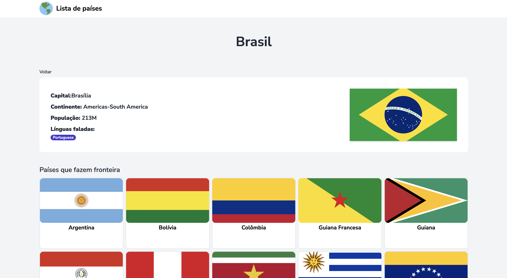

# Lista de Paises

   Home
  

   Página do pais
  

#### Acesse o [link do deploy](https://list-country.vercel.app/),

## 🚀 Tecnologias

Esse projeto foi desenvolvido com as seguintes tecnologias:

- NextJS
- Tailwind
- Typescript

# Aprendizado

Neste projeto integrei com a [API REST Countries](https://restcountries.com/), uma exelente API REST, onde não tive muitos problemas para usar, além disso usei o Server Components do NextJS 13 em algumas partes do projeto.

## 💻 Projeto

Uma página para encontrar seu pais prefereido e saber as informações dele
